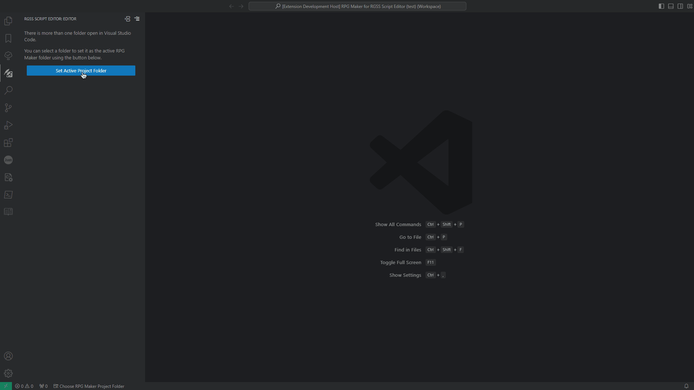
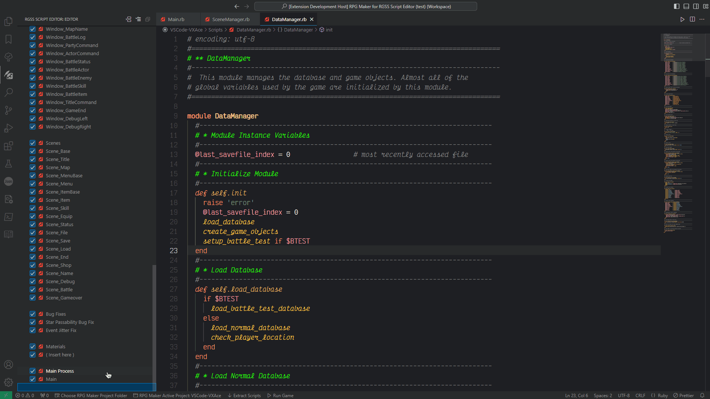
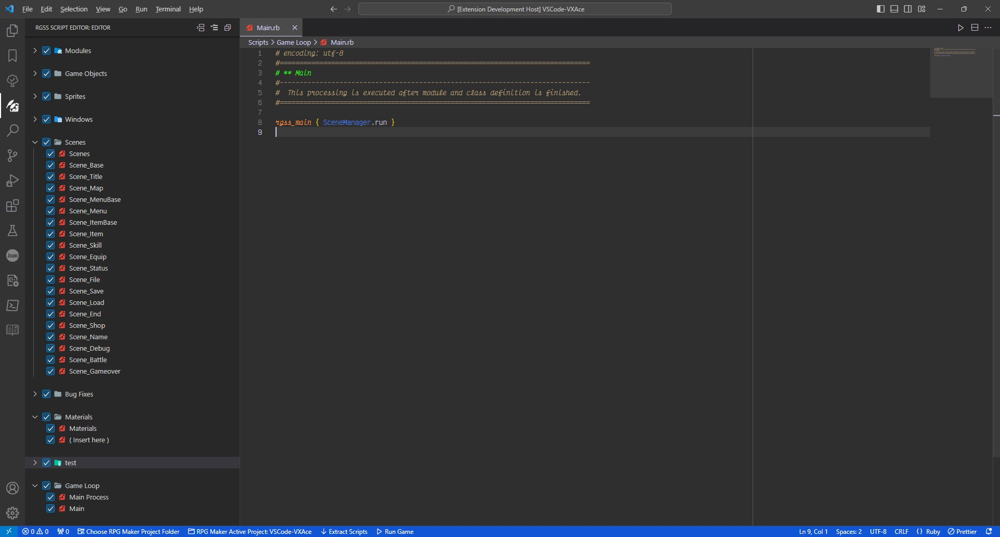
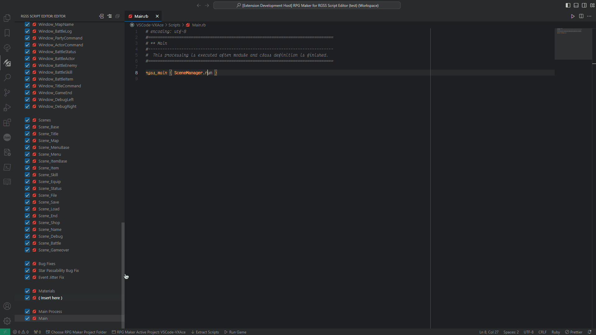
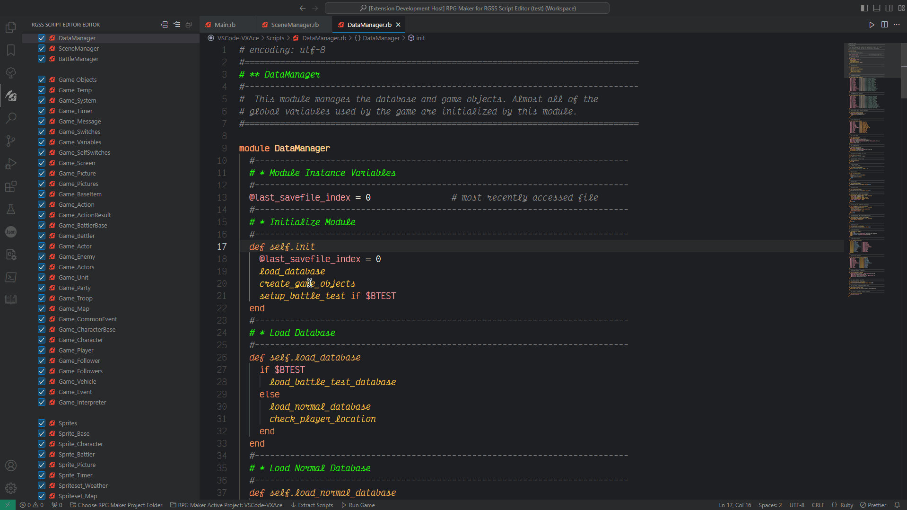

<p align="center">
    
</p>

<h1 align="center">RGSS Script Editor</h1>
<h3 align="center">This extension should be used for development purposes only!</h3>

## Table of Contents

- [Table of Contents](#table-of-contents)
- [Introduction](#introduction)
  - [Long explanation](#long-explanation)
- [Features](#features)
- [Screenshots](#screenshots)
  - [Extension Editor View](#extension-editor-view)
  - [Run Game Process](#run-game-process)
  - [Game Exception Processing](#game-exception-processing)
- [Requirements](#requirements)
  - [Windows](#windows)
  - [Linux](#linux)
  - [macOS](#macos)
- [Download Links](#download-links)
- [Extension Commands](#extension-commands)
- [Extension Settings](#extension-settings)
- [Known Issues](#known-issues)
- [Contributors](#contributors)

## Introduction

This is an extension for Visual Studio Code that makes VSCode usable as the script editor for any RPG Maker editor based on the RGSS framework:

- RPG Maker XP
- RPG Maker VX
- RPG Maker VX Ace

In a nutshell, this extension extracts each script from the bundle file that RPG Maker uses into individual ruby files.
Once the extraction is done, it creates a backup of the original bundle file (`Scripts.rxdata`, `Scripts.rvdata` or `Scripts.rvdata2`), subsequently it overwrites the original bundle file with a script loader bundle file that loads ruby scripts inside a relative folder based on a text file that dictates the loading order.

Since this extension uses a different approach for loading scripts, **you can use the RPG Maker editor and edit scripts in Visual Studio Code at the same time** without worrying about RPG Maker overwriting the bundled file with outdated data.

### Long explanation

RPG Maker loads all data (database, maps, scripts...) at startup when the editor is launched, so you can modify anything of the project and save it into their appropiate data file (scripts are saved into: `Scripts.rxdata`, `Scripts.rvdata` or `Scripts.rvdata2`), this happens with every modification you do inside the editor.

The problem is that RPG Maker does not save these modifications individually, all files are saved at the same time, this means that even if you do not change anything in the game's scripts and modified something else (for example: the database) all scripts will be overwritten with the initial data that was loaded.

This produces an incompatibility with any external script editor or Visual Studio Code extension that works by overwriting the Scripts bundle data file since the editor will overwrite it everytime the project is saved, so the easy solution is not working with the RPG Maker editor and the external script editor at the same time.

This extension tries to circumvent this limitation by overwriting the script bundle data file with a script loader that will load external scripts inside a relative path within the project's folder, this way you can work on your project inside the RPG Maker at the same time you are creating/modifying the game's scripts externally.

It also allows to specify a load order, skip specific scripts and load all Ruby files inside a folder recursively if you want to organize the scripts inside subfolders, the script loader will read the load_order.txt file and load each script/folder until end of line is reached.

As a security measure, the extension will not allow overwriting the script bundle file (`Scripts.rxdata`, `Scripts.rvdata` or `Scripts.rvdata2`) with the script loader if there are still scripts inside of it that have not yet been extracted.

## Features

- **Version Control**
  - Allows you to have a version control of the game's scripts
  - The script editor view shows VS Code source control diff colors on the tree view
- **Workspace Support**
  - You can change the active folder easily in a workspace.
  - If an important setting is modified, it will re-open the current workspace folder automatically.
- **Run Game**
  - You can run the game within VS Code using a customizable keybind (F12 by default)
  - Both `test` (`debug`) and `console` (RPG Maker VX Ace) modes are supported.
    - Optionally, custom arguments can be used instead of the default ones.
  - You can also specify a custom path to the game, in case you want to run an MKXP-Z executable.
  - You can set the behavior of the extension when running the game executable:
    - **Nothing**: Does nothing, this how RPG Maker Editor behaves (default)
    - **Kill and Run**: Kills the current game process and runs it again.
    - **Allow Multiple**: Allows the user to start more than one game process at the same time.
- **Backup Creation**
  - A back-up of the original scripts bundle file will always be created upon script extraction.
  - You can freely create a bundle file of all scripts as a back-up at any time.
    - All back-ups are named with a timestamp of when they were created.
    - The back-up bundle file will include **all editor sections** (whether they are enabled or disabled)
  - All back ups are saved into the specified folder in the extension's settings.
- **Scripts Extraction**
  - You can extract all scripts inside the bundle file to a custom folder within the project's folder.
  - Each RPG Maker script entry will be converted into the appropiate equivalent for the extension's script editor in the process.
    - Every **nameless entry** with no code will be treated as a **separator**.
    - **Any other entry** will be treated as a **script file**.
    - An entry with no code besides an specific comment this extension creates will be treated as a folder.
  - If you are extracting a bundle file previously created by this extension, **the tree structure will be recreated**.
- **Bundle File Creation**
  - This process is **heavily recommended** when sharing a copy of your game.
  - You can create an RPG Maker bundle file (`Scripts.rxdata`, `Scripts.rvdata` or `Scripts.rvdata2`) using the current enabled scripts.
    - If you do not want to include a folder or a certain script in the final bundle file, you can just uncheck them and it will be ignored when creating the bundle file.
  - You can quickly compile a bundle file with a customizable keybind (CTRL+F5 by default)
    - This bundle file will be saved at the path specified in the extension's settings.
  - You can create a new bundle file with specific scripts on the extension's tree view.
    - You must select manually all editor sections in the tree view you want to include in the package file
  - The bundle file is always created keeping the order and tree structure the user creates (subfolders, separators...)
    - You can later rebuild the tree from any bundle file created by this extension (as well as the loading order) if it is not improperly modified by the user.
- **Import Bundle File**
  - You can import all scripts from an RPG Maker scripts bundle file into the extension.
  - Optionally, you can set whether the import operation can overwrite existing scripts or not.
- **Script Loader**
  - The game will load all scripts files individually based on a load order.
  - Any script can be ignored and not loaded when the game runs.
    - Instead of the old way of commenting the whole script code or deleting it, you can disable it and it won't be loaded.
  - You can reset this script loader on runtime raising an specific exception **(EXPERIMENTAL)**
    - It is not recommended to use this because [it can cause problems](#known-issues)
- **Script Editor**
  - This extension enables a view in VSCode where you can create a tree of script sections and perform several operations on them:
    - Create new sections.
      - You can create new sections of an specific type, the current types available are:
        - Script: Self-explanatory.
        - Folder: You can use it to organize scripts inside folders, all folders are collapsable.
        - Separator: An empty section (no name, no icon...) used to separate sections.
    - Enable/Disable sections.
      - You can enable or disable any section or group of sections.
        - If a section is enabled, it will be loaded when the game runs.
        - If a section is disabled, it will be ignored.
    - Delete sections.
      - Any section can be deleted along with all of its children.
      - **Keep in mind that this action is irreversible!**
    - Rename sections.
      - You can rename sections.
      - All changes will be reflected in its children sections.
    - Drag and drop sections.
      - You can move any group of sections on the tree view.
        - The tree can be arranged in any order desired.
      - The load order is defined by the order of the extension's script editor, before running the game.
      - You can also drag and drop sections on the VS Code editor to open them
        - Folders will open all scripts inside recursively.
    - Copy/Paste sections.
      - You can copy and paste sections on the tree view.
    - Collapse/Expand sections.
      - You can expand or collapse folder sections.
    - Reveal active script on the tree view
    - Reveal sections on VS Code explorer
      - You can reveal a script section on the VS Code built-in explorer
    - Reveal sections on the OS file explorer
      - You can reveal a script section on the operating system file explorer
    - Editor Mode.
      - There are two editor modes available, you can switch freely between them:
        - **Merge Mode**: Merges any supported section with the section in which they are dropped (default)
        - **Move Mode**: Moves the selected sections to the next position of the section where they are dropped inside the same parent section.
- **Game Exception Processing**
  - This extension can process the exception that killed the game in the last test game session.
  - The extension backtrace will be shown in a markdown file besides the active editor.
  - VSCode built-in peek menu will be used to show each backtrace location.
    - Known problem: VSCode built-in menu does not support [ordering the file locations](https://github.com/microsoft/vscode/issues/202664)

## Screenshots

### Extension Editor View







### Run Game Process



### Game Exception Processing



## Requirements

### Windows

- [Visual Studio Code](https://code.visualstudio.com/)

### Linux

- [Visual Studio Code](https://code.visualstudio.com/)
- [Wine](https://www.winehq.org/) (preferably the latest version)
  - Wine should available on your system, which will be used to run the Windows game executable.
  - You can check if Wine is installed in your system with: `wine --version`
  - **IMPORTANT: If you use MKXP-Z for Linux you won't need to install Wine.**
    - Wine is only required for RPG Maker Windows executables.
  - You can also use any other Wine fork with this extension.

### macOS

- [Visual Studio Code](https://code.visualstudio.com/)
- **Not tested in macOS**

## Download Links

- [Visual Studio Code Marketplace](https://marketplace.visualstudio.com/items?itemName=SnowSzn.rgss-script-editor)
- [Open VSX Marketplace](https://open-vsx.org/extension/SnowSzn/rgss-script-editor)

## How To Use

This extension operates on the root folder of your project (where Game.exe is), it determines the RPG Maker version you are using by checking the Scripts bundle file which should be located in the Data folder for every RPG Maker version, this file could be one of the following:

    Data/Scripts.rvdata2 (for RPG Maker VX Ace)
    Data/Scripts.rvdata (for RPG Maker VX)
    Data/Scripts.rxdata (for RPG Maker XP)

As soon as the extension is enabled, you should see a new container in VS Code activity bar with a gem icon:

This container provides a new tree view which you will use as the new script editor.

If opening your project for the first time, it will ask you to extract all scripts from the bundled Scripts data file, once done, the script editor should show all individual scripts within the relative folder where all scripts should be created (you can change this folder in the extension settings)

The status bar is also used to show some useful buttons, you can also use keybinds instead of these buttons (like F12 to start the game)

**If the extension fails to detect the RPG Maker version, you won't be able to use it, make sure you are opening the correct folder in VS Code.**

## Extension Commands

The commands in this list that has the "Usable only in the tree view editor" are commands that do not work if called from the command palette.

These commands are identified with ellipses (such as the command "Create Section...").

- `rgss-script-editor.setProjectFolder`
  - Sets the extension's working folder to the selected project folder
- `rgss-script-editor.openProjectFolder`
  - Opens the current project folder in the OS file explorer
- `rgss-script-editor.extractScripts`
  - Extracts all valid script files from the RPG Maker Scripts bundle file
  - You can extract the script files as many times as you want if you have included new scripts in it
  - Beware that the script files inside the bundle file will **overwrite existing files** on the extracted scripts folder
- `rgss-script-editor.importScripts`
  - Imports all scripts available inside a RPG Maker bundle scripts file
  - You can choose to whether let the extension overwrite existing scripts or not
  - Useful to import scripts previously exported using this extension
- `rgss-script-editor.createScriptLoader`
  - Creates the script loader bundle file
  - The command will fail if there are valid script files inside the bundle file
  - You can use this command to recreate the script loader in case it was modified or updated in a future version of the extension
- `rgss-script-editor.createBundleFile`
  - Creates a bundle file with the current enabled sections (scripts/folders...) in the tree view
  - The bundle file created keeps the same load order and tree structure as the tree view
- `rgss-script-editor.createBackupBundleFile`
  - Creates a backup bundle file with all sections (scripts/folders...) in the tree view
  - **All sections are included**, whether they are enabled or disabled
  - The bundle file is automatically saved on the extension's back up folder
  - The bundle file created keeps the same load order and tree structure as the tree view
- `rgss-script-editor.createSelectedBundleFile`
  - Creates a bundle file with the selected scripts in the tree view
  - **All selected sections are included**, whether they are enabled or disabled
  - The bundle file created keeps the same load order and tree structure as the tree view
- `rgss-script-editor.compileBundleFile`
  - Compiles current enabled scripts
  - You can use this to automatize the creation of a bundle file for game distribution.
- `rgss-script-editor.runGame`
  - Runs the game
- `rgss-script-editor.processGameException`
  - Process the last game exception that was captured by the extension
- `rgss-script-editor.chooseEditorMode`
  - Chooses the current tree view editor mode
  - Each mode makes the tree view editor behave differently
- `rgss-script-editor.openLoadOrder`
  - Opens the load order file in the VSCode editor
- `rgss-script-editor.sectionCreate`
  - Creates a new section on the tree view
  - Usable only in the tree view editor
- `rgss-script-editor.sectionDelete`
  - Deletes an existing section on the tree view
  - Usable only in the tree view editor
- `rgss-script-editor.sectionRename`
  - Renames an existing section on the tree view
  - Usable only in the tree view editor
- `rgss-script-editor.sectionMove`
  - Move section/s on the tree view
  - Usable only in the tree view editor
- `rgss-script-editor.sectionCopy`
  - Copy section/s from the tree view into the clipboard
  - Usable only in the tree view editor
- `rgss-script-editor.sectionPaste`
  - Paste section/s from the clipboard into the tree view
  - Usable only in the tree view editor
- `rgss-script-editor.sectionToggleLoad`
  - Toggles the load status (enabled/disabled) of the section/s on the tree view
  - Usable only in the tree view editor
- `rgss-script-editor.sectionToggleCollapse`
  - Toggles the collapsible status (collapsed/expanded) of the section/s on the tree view
  - Usable only in the tree view editor
- `rgss-script-editor.sectionRevealInVSCodeExplorer`
  - Reveals the selected section (script/folder) in the VSCode explorer tab
  - Usable only in the tree view editor
- `rgss-script-editor.sectionOpenInExplorer`:
  - Reveals the selected section (script/folder) in the OS file explorer
  - Usable only in the tree view editor

## Extension Settings

This extension contributes the following settings:

- `rgssScriptEditor.debug.logToConsole`
  - Enables this extension to log information to a VSCode output channel.
- `rgssScriptEditor.debug.logToFile`
  - Enables this extension to log information to a file inside the project's folder.
- `rgssScriptEditor.extension.quickStart`
  - This setting enables/disables the extension's quick start mode.
  - Quick start will set the extension's active project folder automatically based on the current context:
    - If only one folder is opened and it is a valid RPG Maker project it will be activated.
    - If a workspace is opened (several folders) you will be able to choose the appropiate folder to activate with a button in the status bar.
    - If no folder is opened or the opened folders are not valid RPG Maker projects the extension will deactivate its UI elements.
- `rgssScriptEditor.extension.autoReveal`
  - Allows the extension to reveal the active script file on the extension's script editor view.
- `rgssScriptEditor.extension.filesEndOfLine`
  - Sets the EOL characters that the extension will use when creating script files.
  - Available types:
    - CRLF (\r\n)
    - LF (\n)
    - auto (Based on the OS)
- `rgssScriptEditor.extension.recreateScriptLoader`
  - Allows the extension to re-create the script loader every time an RPG Maker project is opened.
  - Useful to let the extension update the script loader between updates.
  - Optionally, you can disable this behavior.
- `rgssScriptEditor.extension.importScriptsOverwrite`
  - Sets whether to allow the extension to overwrite script files when importing a bundle scripts file or not
  - If set to false, a folder will be created where all imported scripts will be placed.
- `rgssScriptEditor.external.backUpsFolder`
  - The relative path within the project's folder where all back ups will be saved.
- `rgssScriptEditor.external.scriptsFolder`
  - The relative path within the project's folder where all scripts will be extracted.
- `rgssScriptEditor.external.extensionLogFileFolder`
  - The relative path within the project's folder where the extension log file is created.
- `rgssScriptEditor.external.gameLogFileFolder`
  - The relative path within the project's folder where the game log file is created.
- `rgssScriptEditor.external.scriptsCompileFolder`
  - The relative path within the project's folder where the compiled scripts bundle file is saved.
- `rgssScriptEditor.gameplay.gameExecutablePath`
  - The relative path to the game executable inside the project folder.
    - You can change this option to allow MKXP-Z executable to be launched.
- `rgssScriptEditor.gameplay.useWine`
  - Sets the command to invoke Wine to run the game executable. **(Linux Only!)**
  - If a Linux-specific executable is used to run the game, you won't need to use this setting.
- `rgssScriptEditor.gameplay.runGameBehavior`
  - Choose how the game executable is handled when it is already running.
  - Behaviors available:
    - Nothing: Does nothing, this how RPG Maker behaves (default)
    - Kill and Run: Kills the current game process and runs it again
    - Allow Multiple: Allows the user to start more than one game process at the same time
- `rgssScriptEditor.gameplay.automaticArgumentsDetection`
  - Enables/disables automatic arguments detection mode.
  - If enabled, the extension will automatically choose the appropiate arguments based on the RPG Maker version detected.
  - **IMPORTANT:**
    - If you want to use custom arguments **you must disable this mode.**
- `rgssScriptEditor.gameplay.editorTestMode`
  - Enables/disables test (debug) mode.
  - If enabled, the extension will run the game on debug mode.
  - **If custom arguments are used, this option is ignored.**
- `rgssScriptEditor.gameplay.nativeConsole`
  - Enables/disables RPG Maker native console. **(RPG Maker VX Ace only!)**
  - If enabled, the extension will run the game allocating a console window.
  - **If custom arguments are used, this option is ignored.**
- `rgssScriptEditor.gameplay.customArguments`
  - Set your own custom arguments to run the game with.
  - Arguments must be separated by a whitespace.
  - **IMPORTANT:**
    - You must disable `rgssScriptEditor.gameplay.automaticArgumentsDetection` to use this
- `rgssScriptEditor.gameplay.gameExceptionAutoProcess`
  - Enables/Disables game exception automatic process mode.
  - The extension will show you an information window about the last detected exception.
- `rgssScriptEditor.gameplay.gameExceptionShowInEditor`
  - Allows the extension to show a markdown file besides the active editor with the backtrace information.
    - This is pretty much required since VSCode peek menu does not support [ordering the files](https://github.com/microsoft/vscode/issues/202664).

## Known Issues

I have listed here all errors I have encountered while testing the extension along with their respective solution.

If you find an issue not listed here, feel free to report it back.

---

> [SyntaxError] Invalid Multibyte char (US-ASCII) Exception

There is a high chance that this will happen using RPG Maker VX Ace since that's the only RPG Maker editor running RGSS3 which it is based on Ruby 1.9+.

The other versions of the engine (XP and VX) runs with older versions of Ruby in which `$KCODE` is supported, this global variable is used to determine the encoding of a script file when Ruby is trying to load it.

So basically, when using RPG Maker VX Ace, errors may occur because Ruby 1.9+ does not _"detect"_ the script file encoding, so it fails when trying to load it using `Kernel.load` or `Kernel.require`.

This error is easily fixed by adding `# encoding: utf-8` in the first line of the script contents like:

```ruby
# encoding: utf-8

module MyModule
  # ...
end
```

**It is very important that the encoding is specified at the very first line of the script!**

Like I said before, this workaround is not needed for older versions of RPG Maker that still uses `$KCODE`, but to avoid problems, I have made the extension add this line in _every script_ that it is extracted from the bundle file or created using the extension's editor view automatically so you won't have to.

---

> [LoadError] no such file to load -- Exception

This exception may happen for a number of reasons:

- **The file trying to load simply does not exists**

Make sure that **all files** within the text file that defines the load order **exists** in the specified path.

If you don't want to load a script file you can simply remove the script or ignore it disabling it using the script editor view (or with a `#` character at the start of the line)

```txt
script.rb
another script.rb
Subfolder/
#skipped script.rb
#another skipped script.rb
#Skipped Subfolder/
```

- **The file exists, but it still crashes**

If the file exists and the game still crashes you should make sure the path to the script file does not have special characters, specially in the script's name.

I made sure to remove all of them that I know from all scripts when extraction is done, but to be fully sure try not to use special characters to name your scripts.

For example, these characters are invalid:

- '▼': Character that RPG Maker uses to define sections.
  - ./Scripts/▼ Modules.rb
- '■': Some community plugins may have this character too.
  - ./Scripts/■ My Ruby Script.rb

The extension uses a regular expression to remove invalid characters from the script's name, I tried to include as many invalid combinations as possible but I may have missed some.

---

> [SystemStackError] stack level too deep

**You may encounter this problem if you try to restart the script loader at runtime.**

Restarting game scripts at runtime is a task that is not recommended due to the numerous problems and undefined behavior issues it can cause.

A `SystemStackError` error can be caused by many reasons, and if you are not resetting the script loader it is probably it is not this extension's fault, but in case you are using the "reset script loader" feature, it is very likely it could be the definition of aliases in classes and modules.

For example this is the code I used to trigger the reset (on RPG Maker VX Ace):

```ruby
class Scene_Base
  alias reset_script_loader update # <- Error here

  def update
    reset_script_loader
    raise ScriptLoader::ResetLoader if Input.press?(:F5)
  end
end
```

If you allow the scripts to reload again, Ruby will alias the method again, causing a `SystemStackError` when the method Scene_Base#update is called (since it was aliased before the restart).

A simple solution will be checking if the alias exists before doing it

```ruby
class Scene_Base
  alias reset_script_loader update unless method_defined?(:reset_script_loader)

  def update
    reset_script_loader
    raise ScriptLoader::ResetLoader if Input.press?(:F5)
  end
end
```

Nevertheless this feature should not be used, hence the **EXPERIMENTAL** label on it, since scripts are loaded on top of the previous scripts causing possible undefined or unexpected behavior problems.

## Contributors

- [marshal](https://github.com/hyrious/marshal)
